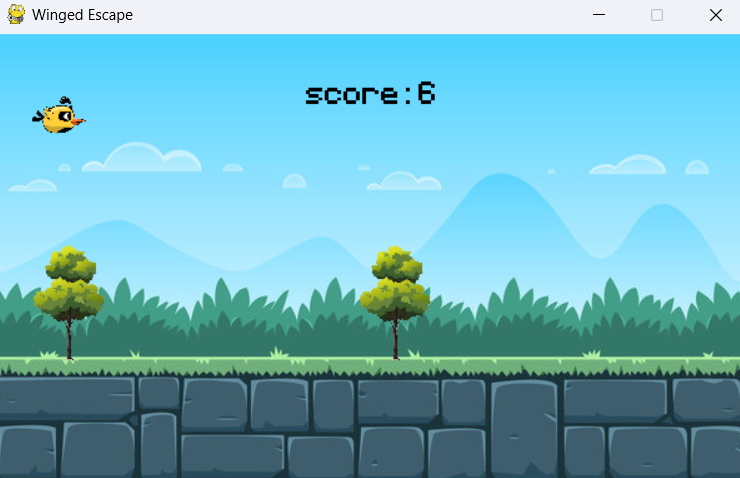
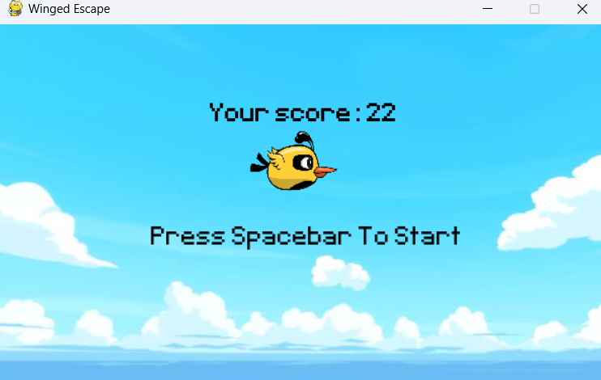

Sure, here's a README file template for your game:

---

# Winged Escape

Winged Escape is a simple yet addictive arcade-style game developed using the Pygame library in Python.

## Table of Contents

- [Features](#features)
- [Installation](#installation)
- [How to Play](#how-to-play)
- [Controls](#controls)
- [Gameplay Screenshots](#gameplay-screenshots)
- [Contributing](#contributing)

## Features

- Simple and intuitive gameplay.
- Randomly generated obstacles to keep the game challenging.
- Score tracking to compete with yourself and others.

## Installation

1. Make sure you have Python installed. You can download it from [python.org](https://www.python.org/).
2. Install the Pygame library using pip:

    ```bash
    pip install pygame
    ```

3. Clone or download this repository to your local machine.

## How to Play

- Launch the game by running `main.py`.
- Press the spacebar to make the bird jump and avoid obstacles.
- Navigate through the obstacles and try to survive as long as possible to achieve a high score.

## Controls

- Press the spacebar to make the bird jump.

## Gameplay Screenshots



*Caption: Gameplay screenshot showcasing the bird navigating through obstacles.*



*Caption: Another gameplay screenshot demonstrating the score tracking feature.*

## Contributing

Contributions are welcome! If you have any ideas for improvements or find any issues, feel free to open an issue or create a pull request.
